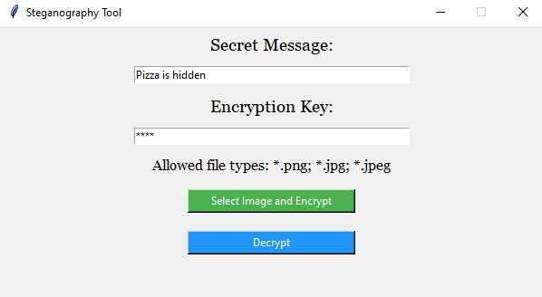
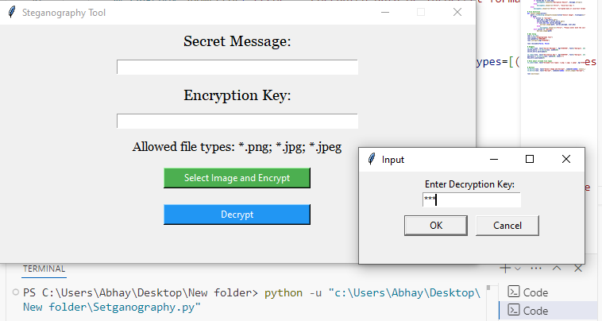
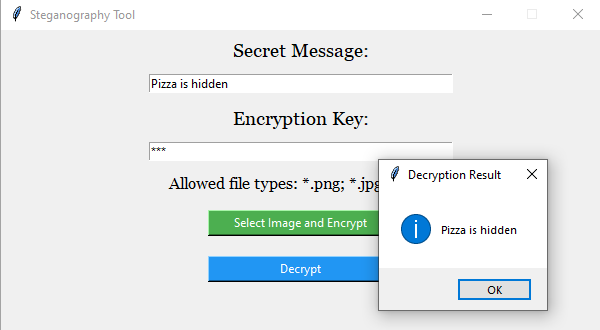

# Steganography Tool

This is a simple steganography tool that allows you to hide a secret message inside an image and retrieve it using a decryption key. The tool uses `tkinter` for the GUI and `opencv` for image processing.

## Features

- Encrypt a secret message into an image using a key.
- Decrypt the hidden message from an image using the correct key.
- Supports PNG, JPG, and JPEG image formats.

## Requirements

- Python 3.x
- OpenCV
- Tkinter (usually included with Python)

## Installation

1. Clone the repository or download the `Image-Setgano.py` file.

```sh
git clone https://github.com/Abhaykushwah/Secure-Data-Hiding-in-Image-Using-Steganography
cd Secure-Data-Hiding-in-Image-Using-Steganography
```

2. Install the required Python packages.

```sh
pip install opencv-python
```

## Usage

1. Run the `Image-Setgano.py` script.

```sh
python Image-Setgano.py
```

2. The GUI will open with options to enter a secret message and an encryption key.

3. Click on "Select Image and Encrypt" to choose an image file and encrypt the message into it.

4. To decrypt a message, click on "Decrypt" and select the image file containing the hidden message. Enter the correct decryption key to retrieve the message.

## Screenshots







## Author

- [Abhay Kushwah](http://github.com/abhaykushwah)


